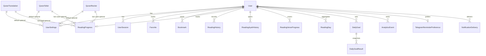

# Database Schema — Quron Yo'li

This document explains every Prisma/PostgreSQL relationship for the Quron Yo'li backend.

Quran Arabic text, translation text, tafsir text, and audio assets are **not** stored here.
Verse content is fetched from **Quran.Foundation**. This database stores:

- authentication and user profile data
- user preferences
- Quran.Foundation **resource catalogs** (metadata IDs only)
- user engagement and reading analytics using chapter/verse coordinates

## Entity relationship overview



### Prisma vs SQL-only constraints

Prisma models describe columns, FKs, and most uniques. Several invariants exist **only in SQL migrations** (not fully expressible / not mirrored in `schema.prisma`):

| Kind | Examples |
| --- | --- |
| Partial unique indexes | Active bookmark per user/ayah (`deleted_at IS NULL`); one open-ended active goal per `(user_id, metric)` |
| CHECK constraints | Chapter/verse ranges, font sizes > 0, `active_seconds >= 0`, goal date ranges, reminder `local_time ~ HH:mm` |

Always review `prisma/migrations/**/*.sql` when changing uniqueness or validation rules — regenerating from Prisma alone will not recreate these.

## Core identity

### `User` (`users`)
Primary application identity. Telegram users are upserted by unique `telegram_id`.

| Field | Notes |
| --- | --- |
| `id` | UUID PK |
| `telegramId` | Unique external Telegram identity |
| `isActive` | Hard disable flag for auth gates |
| `deletedAt` | Soft delete timestamp |
| timestamps | `createdAt`, `updatedAt` |

### `UserSession` (`user_sessions`)
Refresh-token sessions for JWT auth.

**Relationship:** `User` 1 → N `UserSession`  
**FK:** `user_sessions.user_id → users.id`  
**Cascade:** `ON DELETE CASCADE` — deleting a user removes all sessions.

---

## Preferences

### `UserSettings` (`user_settings`)
One settings row per user.

**Relationship:** `User` 1 → 0..1 `UserSettings`  
**FK:** `user_settings.user_id → users.id` (also PK)  
**Cascade:** `ON DELETE CASCADE`

Optional catalog defaults:

| FK | Target | On delete |
| --- | --- | --- |
| `default_translation_id` | `quran_translations.id` | `SET NULL` |
| `default_tafsir_id` | `quran_tafsirs.id` | `SET NULL` |
| `default_reciter_id` | `quran_reciters.id` | `SET NULL` |

Catalog cleanup never deletes user settings; defaults become null.

---

## Quran.Foundation resource catalogs

These tables store **metadata only** (provider resource IDs, names, languages).
They do **not** store ayah text or audio blobs.

### `QuranTranslation` (`quran_translations`)
Unique on `(provider, external_id)`. Soft-deletable via `deletedAt`.

### `QuranTafsir` (`quran_tafsirs`)
Same identity pattern as translations.

### `QuranReciter` (`quran_reciters`)
Same identity pattern; optional style/arabic name.

Used by:

- `UserSettings` defaults (`SET NULL`)
- `ReadingProgress` last-used resources (`SET NULL`)

---

## Engagement

### `Favorite` (`favorites`)
Exactly one favorite marker per user/chapter/verse.

**Relationship:** `User` 1 → N `Favorite`
**FK:** `favorites.user_id → users.id`
**Cascade:** `ON DELETE CASCADE`
**Unique:** `(user_id, chapter_number, verse_number)`
**Index:** `(user_id, created_at DESC, id DESC)` for newest-first keyset pagination

Location is stored as coordinates (`chapterNumber`, `verseNumber`), not a Quran text FK.
Hard delete only (recreate to re-favorite).

### `Bookmark` (`bookmarks`)
Named/noted positions. Soft-deletable via `deletedAt`.
Supports optional `wordNumber`, `audioOffsetMs`, `label`, `note`, `color`.

**Relationship:** `User` 1 → N `Bookmark`
**FK:** `bookmarks.user_id → users.id`
**Cascade:** `ON DELETE CASCADE`
**Partial unique (migration):** `(user_id, chapter_number, verse_number) WHERE deleted_at IS NULL`
**Indexes:**
- `(user_id, created_at DESC, id DESC) WHERE deleted_at IS NULL` active list keyset
- `(user_id, created_at DESC, id DESC)` general keyset
- `(user_id, chapter_number, verse_number)` location lookup
- `(user_id, color)` exact color filter
- `(user_id, deleted_at DESC, id DESC)` soft-delete / trash

Only one **active** bookmark per user/ayah is allowed. Soft-deleted rows may be replaced by a new active bookmark on the same ayah.

---

## Reading

### `ReadingProgress` (`reading_progress`)
Single latest cursor per user.

**Relationship:** `User` 1 → 0..1 `ReadingProgress`  
**FK:** `reading_progress.user_id → users.id` (PK)  
**Cascade:** `ON DELETE CASCADE`

Optional last-used catalog FKs use `ON DELETE SET NULL`.

### `ReadingHistory` (`reading_histories`)
Bounded reading sessions (not every verse-open event).

Stores start/end coordinates and timestamps, `versesRead`, `activeSeconds`, and optional `clientSessionKey` for idempotent client sync.

**Relationship:** `User` 1 → N `ReadingHistory`
**FK:** `reading_histories.user_id → users.id`
**Cascade:** `ON DELETE CASCADE`
**Unique:** `(user_id, client_session_key)` (PostgreSQL allows multiple NULL keys)

**Status:** Schema and migrations exist, but **no application writers or readers** use this model today. `GET /reading/history` reads `ReadingAyahHistory`, not `ReadingHistory`. Reserved for future session-based sync.

### `ReadingAyahHistory` (`reading_ayah_histories`)
Append-only record of every successful single-ayah open.

**Relationship:** `User` 1 → N `ReadingAyahHistory`
**FK:** `reading_ayah_histories.user_id → users.id`
**Cascade:** `ON DELETE CASCADE`
**Indexes:** `(user_id, opened_at DESC, id DESC)`, `(user_id, chapter_number, verse_number, opened_at DESC)`

### `ReadingVerseProgress` (`reading_verse_progress`)
Unique per-ayah progress for completion percentage and recently-read lists.

**Relationship:** `User` 1 → N `ReadingVerseProgress`
**FK:** `reading_verse_progress.user_id → users.id`
**Cascade:** `ON DELETE CASCADE`
**Unique:** `(user_id, chapter_number, verse_number)`
**Indexes:** `(user_id, last_read_at DESC, id DESC)`, `(user_id, chapter_number)`

Stores `firstReadAt`, `lastReadAt`, and `readCount` only — never Quran text.

### `ReadingDay` (`reading_days`)
Daily aggregate for streaks/dashboards.

**Relationship:** `User` 1 → N `ReadingDay`
**FK:** `reading_days.user_id → users.id`
**Cascade:** `ON DELETE CASCADE`
**Unique:** `(user_id, local_date)`
**Indexes:** `(user_id, local_date DESC)`, partial `(user_id, local_date DESC) WHERE verses_read > 0`

`ReadingAyahHistory` is the source of truth for every ayah open; `ReadingVerseProgress` and `ReadingDay` are query-optimized rollups. `ReadingHistory` remains available for future session-based sync.

Ayah-open writes set / leave `ReadingDay.activeSeconds` at **0** (only `versesRead` increments). There is currently no heartbeat or session writer for active time.

---

## Goals

### `DailyGoal` (`daily_goals`)
Concurrent goals are supported via `DailyGoalMetric`:

- `VERSES` — progress from `ReadingDay.versesRead`
- `MINUTES` — progress from `floor(ReadingDay.activeSeconds / 60)`

Because ayah opens never increment `activeSeconds`, **MINUTES goals report 0 progress** until an active-seconds writer lands (see [future-improvements.md](./future-improvements.md)).

Soft-deletable and date-ranged (`effectiveFrom` / `effectiveTo`).

**Relationship:** `User` 1 → N `DailyGoal`  
**FK:** `daily_goals.user_id → users.id`  
**Cascade:** `ON DELETE CASCADE`

Partial unique index (migration):

```sql
UNIQUE (user_id, metric)
WHERE is_enabled = true AND deleted_at IS NULL AND effective_to IS NULL
```

This allows historical goals while preventing two open-ended active goals of the same metric.

### `DailyGoalResult` (`daily_goal_results`)
Immutable-ish daily snapshots for a goal.

**Relationship:** `DailyGoal` 1 → N `DailyGoalResult`  
**FK:** `daily_goal_results.daily_goal_id → daily_goals.id`  
**Cascade:** `ON DELETE CASCADE`  
**Unique:** `(daily_goal_id, local_date)`

Deleting a goal removes its result rows. Soft-deleting a goal keeps results until hard delete/cascade.

---

## Telegram notifications

### `TelegramReminderPreference` (`telegram_reminder_preferences`)
One preference row per user for daily Telegram reminders.

**Relationship:** `User` 1 → 0..1 `TelegramReminderPreference`  
**FK:** `telegram_reminder_preferences.user_id → users.id`  
**Cascade:** `ON DELETE CASCADE`  
**Unique:** `user_id`  
**Constraint:** `local_time` matches `HH:mm`

Timezone is read from `UserSettings.timezone` at dispatch time (not duplicated on the preference row).

### `NotificationDelivery` (`notification_deliveries`)
Durable at-most-once delivery log for daily reminders.

**Relationship:** `User` 1 → N `NotificationDelivery`  
**FK:** `notification_deliveries.user_id → users.id`  
**Cascade:** `ON DELETE CASCADE`  
**Unique:** `(user_id, type, local_date)`  
**Enums:** `NotificationDeliveryType` (`DAILY_REMINDER`), `NotificationDeliveryStatus` (`PENDING`, `SENT`, `FAILED`, `SKIPPED`)

---

## Analytics

### `AnalyticsEvent` (`analytics_events`)
Product analytics separate from canonical reading history.

**Relationship:** `User` 0..1 → N `AnalyticsEvent`  
**FK:** `analytics_events.user_id → users.id` (nullable)  
**Cascade:** `ON DELETE SET NULL` — user deletion anonymizes events instead of erasing analytics history.

Optional `idempotencyKey` is globally unique for safe retries.

**Indexes:**
- `(user_id, occurred_at)` — recent user activity
- `(event_name, occurred_at)` — global event timelines
- `(user_id, event_name, occurred_at)` — per-user filtered statistics

See [analytics.md](./analytics.md) for ingestion, buffering, and statistics APIs.

---

## Cascade summary

| Child | Parent | On delete |
| --- | --- | --- |
| `UserSession` | `User` | Cascade |
| `UserSettings` | `User` | Cascade |
| `Favorite` | `User` | Cascade |
| `Bookmark` | `User` | Cascade |
| `ReadingProgress` | `User` | Cascade |
| `ReadingHistory` | `User` | Cascade |
| `ReadingAyahHistory` | `User` | Cascade |
| `ReadingVerseProgress` | `User` | Cascade |
| `ReadingDay` | `User` | Cascade |
| `DailyGoal` | `User` | Cascade |
| `DailyGoalResult` | `DailyGoal` | Cascade |
| `TelegramReminderPreference` | `User` | Cascade |
| `NotificationDelivery` | `User` | Cascade |
| `AnalyticsEvent` | `User` | SetNull |
| `UserSettings.default*` | Catalog tables | SetNull |
| `ReadingProgress.last*` | Catalog tables | SetNull |

## Soft delete policy

| Model | Soft delete field | Purpose |
| --- | --- | --- |
| `User` | `deletedAt` | Account deactivation without destroying FK graph immediately |
| `Bookmark` | `deletedAt` | Recoverable bookmarks |
| `DailyGoal` | `deletedAt` | Disable/hide goals while retaining results |
| `QuranTranslation` / `QuranTafsir` / `QuranReciter` | `deletedAt` | Hide retired provider resources without breaking historical FKs |

Favorites use hard uniqueness and hard delete (toggle by delete/recreate).
Bookmarks allow one active row per user/ayah via a partial unique index; soft-deleted bookmarks can be recreated.
Sessions use `revokedAt` rather than soft delete.

## Intentionally absent tables

Do **not** add:

- surah / chapter content tables
- ayah / verse text tables
- word-by-word Arabic tables
- translation text / tafsir text storage
- audio file / mushaf page content tables

All Quran content is retrieved from Quran.Foundation using external resource IDs and chapter/verse coordinates.

## Migrations

1. `20260730120000_init_auth` — users + sessions
2. `20260730130000_quran_domain_schema` — domain schema, CHECKs, partial active-goal uniqueness
3. `20260730140000_reading_ayah_tracking` — ayah open history, unique verse progress, daily DESC index
4. `20260730150000_favorites_bookmarks_indexes` — favorites/bookmarks keyset indexes + active bookmark uniqueness
5. `20260730160000_telegram_notifications` — reminder preferences + notification deliveries (+ `local_time` CHECK)
6. `20260730170000_analytics_user_event_index` — analytics `(user_id, event_name, occurred_at)` index
7. `20260730180000_production_hardening_indexes` — additional production indexes

Apply with:

```bash
npx prisma migrate deploy
npx prisma generate
```
