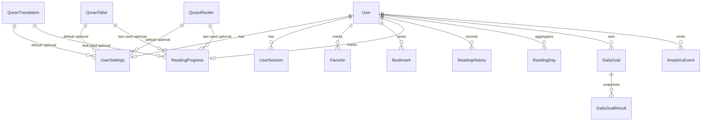

# Database Schema — Quron Yo'li

This document explains every Prisma/PostgreSQL relationship for the Quron Yo'li backend.

Quran Arabic text, translation text, tafsir text, and audio assets are **not** stored here.
Verse content is fetched from **Quran.Foundation**. This database stores:

- authentication and user profile data
- user preferences
- Quran.Foundation **resource catalogs** (metadata IDs only)
- user engagement and reading analytics using chapter/verse coordinates

## Entity relationship overview



## Core identity

### `User` (`users`)
Primary application identity. Telegram users are upserted by unique `telegram_id`.

| Field | Notes |
| --- | --- |
| `id` | UUID PK |
| `telegramId` | Unique external Telegram identity |
| `isActive` | Hard disable flag for auth gates |
| `deletedAt` | Soft delete timestamp |
| timestamps | `createdAt`, `updatedAt` |

### `UserSession` (`user_sessions`)
Refresh-token sessions for JWT auth.

**Relationship:** `User` 1 → N `UserSession`  
**FK:** `user_sessions.user_id → users.id`  
**Cascade:** `ON DELETE CASCADE` — deleting a user removes all sessions.

---

## Preferences

### `UserSettings` (`user_settings`)
One settings row per user.

**Relationship:** `User` 1 → 0..1 `UserSettings`  
**FK:** `user_settings.user_id → users.id` (also PK)  
**Cascade:** `ON DELETE CASCADE`

Optional catalog defaults:

| FK | Target | On delete |
| --- | --- | --- |
| `default_translation_id` | `quran_translations.id` | `SET NULL` |
| `default_tafsir_id` | `quran_tafsirs.id` | `SET NULL` |
| `default_reciter_id` | `quran_reciters.id` | `SET NULL` |

Catalog cleanup never deletes user settings; defaults become null.

---

## Quran.Foundation resource catalogs

These tables store **metadata only** (provider resource IDs, names, languages).
They do **not** store ayah text or audio blobs.

### `QuranTranslation` (`quran_translations`)
Unique on `(provider, external_id)`. Soft-deletable via `deletedAt`.

### `QuranTafsir` (`quran_tafsirs`)
Same identity pattern as translations.

### `QuranReciter` (`quran_reciters`)
Same identity pattern; optional style/arabic name.

Used by:

- `UserSettings` defaults (`SET NULL`)
- `ReadingProgress` last-used resources (`SET NULL`)

---

## Engagement

### `Favorite` (`favorites`)
Exactly one favorite marker per user/chapter/verse.

**Relationship:** `User` 1 → N `Favorite`  
**FK:** `favorites.user_id → users.id`  
**Cascade:** `ON DELETE CASCADE`  
**Unique:** `(user_id, chapter_number, verse_number)`

Location is stored as coordinates (`chapterNumber`, `verseNumber`), not a Quran text FK.

### `Bookmark` (`bookmarks`)
Named/noted positions. Multiple bookmarks may exist for the same verse.
Supports optional `wordNumber`, `audioOffsetMs`, `label`, `note`, `color`.
Soft-deletable via `deletedAt`.

**Relationship:** `User` 1 → N `Bookmark`  
**FK:** `bookmarks.user_id → users.id`  
**Cascade:** `ON DELETE CASCADE`

---

## Reading

### `ReadingProgress` (`reading_progress`)
Single latest cursor per user.

**Relationship:** `User` 1 → 0..1 `ReadingProgress`  
**FK:** `reading_progress.user_id → users.id` (PK)  
**Cascade:** `ON DELETE CASCADE`

Optional last-used catalog FKs use `ON DELETE SET NULL`.

### `ReadingHistory` (`reading_histories`)
Bounded reading sessions (not every verse-open event).

Stores start/end coordinates and timestamps, `versesRead`, `activeSeconds`, and optional `clientSessionKey` for idempotent client sync.

**Relationship:** `User` 1 → N `ReadingHistory`  
**FK:** `reading_histories.user_id → users.id`  
**Cascade:** `ON DELETE CASCADE`  
**Unique:** `(user_id, client_session_key)` (PostgreSQL allows multiple NULL keys)

### `ReadingDay` (`reading_days`)
Daily aggregate for streaks/dashboards.

**Relationship:** `User` 1 → N `ReadingDay`  
**FK:** `reading_days.user_id → users.id`  
**Cascade:** `ON DELETE CASCADE`  
**Unique:** `(user_id, local_date)`

`ReadingHistory` is the source of truth for sessions; `ReadingDay` is the query-optimized rollup.

---

## Goals

### `DailyGoal` (`daily_goals`)
Concurrent goals are supported via `DailyGoalMetric`:

- `VERSES`
- `MINUTES`

Soft-deletable and date-ranged (`effectiveFrom` / `effectiveTo`).

**Relationship:** `User` 1 → N `DailyGoal`  
**FK:** `daily_goals.user_id → users.id`  
**Cascade:** `ON DELETE CASCADE`

Partial unique index (migration):

```sql
UNIQUE (user_id, metric)
WHERE is_enabled = true AND deleted_at IS NULL AND effective_to IS NULL
```

This allows historical goals while preventing two open-ended active goals of the same metric.

### `DailyGoalResult` (`daily_goal_results`)
Immutable-ish daily snapshots for a goal.

**Relationship:** `DailyGoal` 1 → N `DailyGoalResult`  
**FK:** `daily_goal_results.daily_goal_id → daily_goals.id`  
**Cascade:** `ON DELETE CASCADE`  
**Unique:** `(daily_goal_id, local_date)`

Deleting a goal removes its result rows. Soft-deleting a goal keeps results until hard delete/cascade.

---

## Analytics

### `AnalyticsEvent` (`analytics_events`)
Product analytics separate from canonical reading history.

**Relationship:** `User` 0..1 → N `AnalyticsEvent`  
**FK:** `analytics_events.user_id → users.id` (nullable)  
**Cascade:** `ON DELETE SET NULL` — user deletion anonymizes events instead of erasing analytics history.

Optional `idempotencyKey` is globally unique for safe retries.

---

## Cascade summary

| Child | Parent | On delete |
| --- | --- | --- |
| `UserSession` | `User` | Cascade |
| `UserSettings` | `User` | Cascade |
| `Favorite` | `User` | Cascade |
| `Bookmark` | `User` | Cascade |
| `ReadingProgress` | `User` | Cascade |
| `ReadingHistory` | `User` | Cascade |
| `ReadingDay` | `User` | Cascade |
| `DailyGoal` | `User` | Cascade |
| `DailyGoalResult` | `DailyGoal` | Cascade |
| `AnalyticsEvent` | `User` | SetNull |
| `UserSettings.default*` | Catalog tables | SetNull |
| `ReadingProgress.last*` | Catalog tables | SetNull |

## Soft delete policy

| Model | Soft delete field | Purpose |
| --- | --- | --- |
| `User` | `deletedAt` | Account deactivation without destroying FK graph immediately |
| `Bookmark` | `deletedAt` | Recoverable bookmarks |
| `DailyGoal` | `deletedAt` | Disable/hide goals while retaining results |
| `QuranTranslation` / `QuranTafsir` / `QuranReciter` | `deletedAt` | Hide retired provider resources without breaking historical FKs |

Favorites use hard uniqueness and hard delete (toggle by delete/recreate).
Sessions use `revokedAt` rather than soft delete.

## Intentionally absent tables

Do **not** add:

- surah / chapter content tables
- ayah / verse text tables
- word-by-word Arabic tables
- translation text / tafsir text storage
- audio file / mushaf page content tables

All Quran content is retrieved from Quran.Foundation using external resource IDs and chapter/verse coordinates.

## Migrations

1. `20260730120000_init_auth` — users + sessions
2. `20260730130000_quran_domain_schema` — domain schema, checks, partial active-goal uniqueness

Apply with:

```bash
npx prisma migrate deploy
npx prisma generate
```
