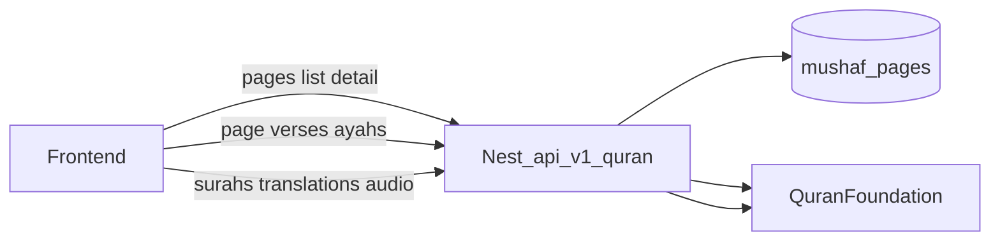

# Backend guide for frontend (post–QF updates)

Base URL: `{API}/api/v1`  
Auth: `Authorization: Bearer <accessToken>` on all `/quran/*` routes.

Nest is **not** a raw Quran.com clone. It proxies Quran Foundation Content API v4 for verse/audio/tafsir bodies, and serves **local synced** Madani page metadata from Postgres.



---

## What changed (for FE)

| Change | Meaning for FE |
| --- | --- |
| `GET /quran/pages` shape | Now `{ pages, total, totalPages }` — **not** a bare array |
| Page verses completeness | Backend defaults `per_page=50` and auto-fetches until `verseCount` ayahs |
| Page verse defaults | Always merges `text_uthmani`, `chapter_id`, `verse_number`, `verse_key`, juz/hizb/rub/page, sajdah |
| Response extras | Page verses include `pagination: { total_records, complete, ... }` |
| Scripts | `indopak_nastaleeq` allowed on `GET /quran/scripts/:script` |

---

## Mushaf book mode — call these

### 1. List pages (bounds / total)

`GET /quran/pages?mushaf=1`

```json
{
  "pages": [
    { "page": 1, "firstVerse": "1:1", "lastVerse": "1:7", "verseCount": 7 }
  ],
  "total": 604,
  "totalPages": 604
}
```

Use `total` / `totalPages` for footer `n/604`. Do **not** hardcode 604 if this is present.

### 2. Page metadata (header chrome)

`GET /quran/pages/:pageNumber?mushaf=1`

CamelCase local DTO:

- `pageNumber`, `mushafId`, `firstVerseKey`, `lastVerseKey`, `verseCount`
- `surahIds`, `juzNumber`, `hizbNumber`, `rubElHizb`
- `verses`: **string keys only** (e.g. `"112:1"`) — not Arabic text
- optional `imageUrl`

404 = pages not synced → backend needs `npm run qf:sync-pages`.

### 3. Page body (Arabic + optional tajweed)

`GET /quran/pages/:pageNumber/verses?mushaf=1&per_page=50`

Optional query (snake_case, QF names):

- `fields=text_uthmani_tajweed` (merged with defaults)
- `translations=<id>`
- `tafsirs=<id>`
- `audio=<recitationId>`
- `words=true` (default on)

Response:

```json
{
  "page": { },
  "verses": [ ],
  "pagination": {
    "per_page": 50,
    "total_records": 15,
    "complete": true,
    "next_page": null
  }
}
```

**Verse wire fields (snake_case from QF):**  
`verse_key`, `chapter_id`, `verse_number`, `text_uthmani`, optional `text_uthmani_tajweed`, `page_number`, `juz_number`, `hizb_number`, `rub_el_hizb_number`, `sajdah_number` / `sajdah_type`, `words[]`.

**FE rule:** if `page.verseCount` is set and `verses.length !== verseCount`, treat as error (incomplete page). Prefer `pagination.complete === true`.

Alias: `GET /quran/ayahs/by-page/:page` → same payload.

### 4. Open from surah/ayah

`GET /quran/pages/lookup?mushaf=1&chapter_number=112`  
(optional `from` / `to` / `page_number` / `juz_number`)

Returns QF lookup JSON (pass-through). Use to resolve Madani page number.

---

## Other Quran endpoints FE already uses

| Need | Endpoint | Notes |
| --- | --- | --- |
| Surah list / names / `bismillah_pre` | `GET /quran/surahs?language=` | Live QF snake_case |
| Surah stream mode | `GET /quran/ayahs/by-surah/:id` | Same verse query params |
| Single ayah | `GET /quran/ayahs/by-key/:key` | Also records reading progress |
| Translations catalog | `GET /quran/translations` | **Local** active catalog |
| Reciters | `GET /quran/audio/chapter-reciters` | **Local** active catalog |
| Chapter audio | `GET /quran/audio/chapter-reciters/:id/:chapter` | Live QF |
| Mushaf picker | `GET /quran/mushafs` | **Static** ids (1,2,3,…,19) |
| Tajweed script bulk | `GET /quran/scripts/uthmani_tajweed` | Optional; page verses + `fields=` is enough |

---

## Important FE rules

1. **Never invent** which ayahs sit on a page — only use `/pages/:n/verses`.
2. **Page meta** (`juz`, `surahIds`) comes from `/pages/:n`; verse Arabic from `/pages/:n/verses`.
3. Responses may be wrapped in the app envelope (`data` / success) — unwrap as today.
4. Mixed casing: page DTOs = **camelCase**; verse bodies = **snake_case** QF (your mappers already handle both).
5. Default mushaf id = **1** (QCF V2 Madani). Pass `mushaf=` when settings pick another.
6. Empty DB → 404 with message to run sync — show sync/retry UI, not fake Madani tables.

---

## Quick test

```bash
# list
curl -H "Authorization: Bearer $TOKEN" "$API/api/v1/quran/pages?mushaf=1"

# page 604 meta + 15 ayahs
curl -H "Authorization: Bearer $TOKEN" "$API/api/v1/quran/pages/604"
curl -H "Authorization: Bearer $TOKEN" \
  "$API/api/v1/quran/pages/604/verses?per_page=50&fields=text_uthmani,text_uthmani_tajweed"
```

Expected for 604: `surahIds: [112,113,114]`, `verseCount: 15`, `verses.length === 15`, `firstVerseKey: "112:1"`, `lastVerseKey: "114:6"`.

---

## Out of product scope (do not expect from Nest yet)

Hadith, Answers, Quran Reflect, verses-by-range, random verse (use Daily Ayah instead).

Related docs: [mushaf-pages.md](./mushaf-pages.md), [rest-api.md](./rest-api.md), [quran-foundation.md](./quran-foundation.md).
