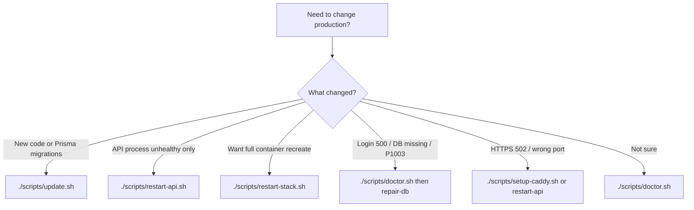

# Production ops runbook

Day-2 operations for the Quron Yo'li API on Docker Compose + Caddy.

Canonical VPS (current production):

| Item | Value |
| --- | --- |
| Host IP | `189.74.96.28` |
| HTTPS hostname | `189.74.96.28.sslip.io` |
| Repo path on server | `/opt/quronyoli/quronyoli_backend` |
| API listen / Caddy upstream | `.env` `PORT=3000` → `127.0.0.1:3000` |
| Public health | `https://189.74.96.28.sslip.io/api/v1/health/ready` |
| Local health | `http://127.0.0.1:3000/api/v1/health/ready` |
| Postgres volume | `quron-yoli_postgres_data` |
| Redis volume | `quron-yoli_redis_data` |

Related docs: [README_DEPLOYMENT.md](../README_DEPLOYMENT.md) (Ubuntu first boot) · [deployment.md](./deployment.md) (build/migrate/rollback) · [sslip-caddy-redeploy.md](./sslip-caddy-redeploy.md) (first HTTPS setup) · [docker.md](./docker.md).

---

## Which command should I run?



| Situation | Command | Postgres data | Caddy |
| --- | --- | --- | --- |
| First install on a new VPS | `./scripts/deploy.sh` | Creates DB on first volume init | Installs + writes Caddyfile + HTTPS check |
| New code / new tables or columns on `main` | `./scripts/update.sh` | **Kept** (additive `prisma migrate deploy`) | Re-synced to `.env` PORT + HTTPS assert |
| Restart Nest only (config/.env reload via recreate) | `./scripts/restart-api.sh` | **Untouched** (postgres/redis not recreated) | Re-synced |
| Restart without rebuild | `REBUILD=0 ./scripts/restart-api.sh` | Untouched | Re-synced |
| Recreate all containers, keep volumes | `./scripts/restart-stack.sh` | **Kept** (no `down -v`) | Re-synced |
| Diagnose anything | `./scripts/doctor.sh` | Read-only | Reports upstream + HTTPS |
| DB missing / empty volume / P1003 | `CONFIRM_RESTORE=yes ./scripts/repair-db.sh [backup]` | Restored from dump | Via restart-api inside repair |
| Manual TLS / upstream fix | `DOMAIN=189.74.96.28.sslip.io ./scripts/setup-caddy.sh` | Untouched | Rewritten |

npm aliases (same scripts):

```bash
npm run deploy:prod
npm run update:prod
npm run restart:api
npm run restart:stack
npm run doctor
CONFIRM_RESTORE=yes npm run repair:db -- backups/<timestamp>
```

Always run from the repo root on the server, as **root** when Caddy must be updated (`/etc/caddy/Caddyfile`).

---

## Hard rules (do not break production data)

1. **Never** `docker compose down -v` or `docker volume rm quron-yoli_postgres_data`.
2. **Never** `prisma migrate reset` / `db push --force-reset` on production.
3. **Never** change `POSTGRES_USER` or `POSTGRES_DB` after the volume was first initialized.
4. Prefer **additive** Prisma migrations in development (`npm run prisma:migrate:dev`), commit `prisma/migrations/`, then `./scripts/update.sh` on the server.
5. Caddy upstream **always** comes from `.env` `PORT` — a stale shell `export PORT=3001` must not be used to “fix” HTTPS.
6. Production Compose must use `-f docker-compose.yml` (scripts do this) so Postgres/Redis stay unpublished.

Volumes that must survive every rebuild:

- `quron-yoli_postgres_data`
- `quron-yoli_redis_data`

---

## Daily / weekly ops

### Ship new API code (keep data)

```bash
cd /opt/quronyoli/quronyoli_backend
./scripts/update.sh
```

Flow:

1. Pre-update `./scripts/backup.sh` (skip with `SKIP_BACKUP=1`)
2. `git pull --ff-only`
3. `docker compose -f docker-compose.yml up -d --build` (volumes kept)
4. Assert database `quron_yoli` exists
5. Wait for local readiness
6. Rewrite Caddy → `127.0.0.1:${PORT}` and assert public HTTPS
7. Ensure QF mushaf pages if incomplete

Useful env flags: `SKIP_BACKUP=1`, `SKIP_GIT_PULL=1`, `SKIP_CADDY=1`, `SKIP_QF_ENSURE=1`.

### Partial restart (API only)

```bash
./scripts/restart-api.sh              # rebuild + recreate api --no-deps
REBUILD=0 ./scripts/restart-api.sh    # docker compose restart api
```

Postgres and Redis containers stay running. Caddy is re-synced afterward.

### Total restart (containers, not data)

```bash
./scripts/restart-stack.sh
SKIP_BACKUP=1 ./scripts/restart-stack.sh
```

Force-recreates postgres, redis, and api **without** deleting named volumes.

### Backups

```bash
./scripts/backup.sh
# Cron (daily 02:00 UTC):
# 0 2 * * * cd /opt/quronyoli/quronyoli_backend && ./scripts/backup.sh >> logs/backup.log 2>&1
```

Writes `backups/<UTC-timestamp>/{postgres.dump,redis.rdb,uploads.tar.gz,MANIFEST.txt}`. Default retention: last 14 dumps (`BACKUP_KEEP`).

---

## Caddy and HTTPS

### How traffic flows

```text
Internet
  → :443 Caddy (TLS for 189.74.96.28.sslip.io)
    → reverse_proxy 127.0.0.1:3000
      → Docker published api container (PORT from .env)
```

`/etc/caddy/Caddyfile` is rewritten by `setup-caddy.sh` to:

```caddy
189.74.96.28.sslip.io {
	encode gzip
	reverse_proxy 127.0.0.1:3000
}
```

`deploy.sh`, `update.sh`, `restart-api.sh`, and `restart-stack.sh` all call this path unless `SKIP_CADDY=1`.

### Required `.env` keys for HTTPS / Telegram

```bash
PORT=3000
TRUST_PROXY=true
TELEGRAM_WEBHOOK_URL=https://189.74.96.28.sslip.io/api/v1/telegram/webhook
TELEGRAM_WEBHOOK_AUTO_REGISTER=true
TELEGRAM_WEBHOOK_SECRET=<min-16-chars>
```

Optional override: `DOMAIN=189.74.96.28.sslip.io` (otherwise DOMAIN is taken from the webhook URL host).

### Classic PORT=3000 vs 3001 failure

Symptom: `curl http://127.0.0.1:3000/...` works, but `https://189.74.96.28.sslip.io/...` returns **502**.

Cause: Caddyfile still points at `127.0.0.1:3001` (stale shell PORT or old rewrite).

Fix:

```bash
./scripts/doctor.sh
DOMAIN=189.74.96.28.sslip.io ./scripts/setup-caddy.sh
# or any root run of:
./scripts/restart-api.sh
curl -sS https://189.74.96.28.sslip.io/api/v1/health/ready
```

Firewall: `ufw allow 80/tcp` and `ufw allow 443/tcp` must stay open for Let's Encrypt + HTTPS.

---

## Database loss / Prisma P1003

### Symptoms

- Readiness `503` with `"database":{"status":"down"}`
- Logs: `database "quron_yoli" does not exist` (Prisma P1003)
- Mini App: login / “Kirish talab qilinadi” + internal error
- `curl` to local API may show connection reset while the entrypoint crash-loops
- `./scripts/ensure-qf-data.sh` fails for the same reason (it needs an existing DB)

### Recover (preferred)

```bash
cd /opt/quronyoli/quronyoli_backend
./scripts/doctor.sh
CONFIRM_RESTORE=yes ./scripts/repair-db.sh backups/<timestamp>
# or latest backup:
CONFIRM_RESTORE=yes ./scripts/repair-db.sh
curl -sS http://127.0.0.1:3000/api/v1/health/ready
curl -sS https://189.74.96.28.sslip.io/api/v1/health/ready
```

`repair-db.sh` will:

1. Ensure postgres/redis are up (volumes preserved)
2. `CREATE DATABASE quron_yoli` if missing
3. Restore `postgres.dump` (and redis/uploads when present)
4. Restart API
5. Run `ensure-qf-data.sh` unless `SKIP_QF_ENSURE=1`

`restore.sh` alone also creates the DB if missing, but does not restart API or ensure QF — prefer `repair-db.sh` for full recovery.

### Empty / wrong volume causes

Most common:

1. Someone ran `docker compose down -v` or pruned the named volume
2. Compose attached a **new empty** `quron-yoli_postgres_data` while old data lives under another volume name
3. Volume was first-initialized without `POSTGRES_DB=quron_yoli` (Postgres only creates that DB on first init)

---

## Diagnose with `doctor.sh`

```bash
./scripts/doctor.sh
```

Reports:

- Compose `ps`
- Local live/ready HTTP status
- Whether `quron_yoli` exists
- Named volume presence / approximate size
- Caddyfile upstream vs `.env` PORT
- `systemctl is-active caddy`
- Public HTTPS ready
- Recent `backups/*/postgres.dump` sizes
- The next recommended command

---

## Verification checklist (after any change)

```bash
# Local
curl -sS http://127.0.0.1:3000/api/v1/health/live
curl -sS http://127.0.0.1:3000/api/v1/health/ready

# Public HTTPS
curl -sS https://189.74.96.28.sslip.io/api/v1/health/ready

# Stack + Caddy + DB overview
./scripts/doctor.sh

# Optional: Telegram webhook
# curl -sS "https://api.telegram.org/bot<TOKEN>/getWebhookInfo"
```

Expect readiness JSON with database, redis, and application all up (HTTP 200).

---

## Script reference

| Script | Purpose | Destructive? |
| --- | --- | --- |
| [`scripts/deploy.sh`](../scripts/deploy.sh) | First-boot: Docker, compose up, Caddy, QF ensure | No volumes deleted |
| [`scripts/update.sh`](../scripts/update.sh) | Day-2: backup, pull, rebuild, Caddy, QF ensure | No volumes deleted |
| [`scripts/restart-api.sh`](../scripts/restart-api.sh) | Rebuild/restart `api` only | No |
| [`scripts/restart-stack.sh`](../scripts/restart-stack.sh) | Force-recreate all services | No volumes deleted |
| [`scripts/setup-caddy.sh`](../scripts/setup-caddy.sh) | Install/rewrite Caddy from `.env` PORT + DOMAIN | Overwrites `/etc/caddy/Caddyfile` only |
| [`scripts/doctor.sh`](../scripts/doctor.sh) | Read-only diagnosis | No |
| [`scripts/backup.sh`](../scripts/backup.sh) | Dump Postgres/Redis/uploads | No |
| [`scripts/restore.sh`](../scripts/restore.sh) | Restore dump (needs `CONFIRM_RESTORE=yes`) | Overwrites DB contents |
| [`scripts/repair-db.sh`](../scripts/repair-db.sh) | Create DB if missing + restore + restart + QF | Overwrites DB contents |
| [`scripts/ensure-qf-data.sh`](../scripts/ensure-qf-data.sh) | Sync mushaf pages when incomplete | Upserts catalog/pages |
| [`scripts/sync-qf.sh`](../scripts/sync-qf.sh) | Full QF catalog + pages sync | Upserts catalog/pages |
| [`scripts/validate-env.sh`](../scripts/validate-env.sh) | Fail closed on placeholder secrets | No |

Shared helpers live in [`scripts/lib/common.sh`](../scripts/lib/common.sh) (`qy_env_port`, `qy_sync_caddy`, `qy_assert_caddy_https`, `qy_ensure_database`, …).

### Common environment flags

| Flag | Used by | Effect |
| --- | --- | --- |
| `SKIP_CADDY=1` | deploy, update, restart-*, sync helpers | Skip Caddy rewrite and HTTPS assert |
| `SKIP_BACKUP=1` | update, restart-stack | Skip pre-op backup |
| `SKIP_GIT_PULL=1` | update | Rebuild current tree only |
| `SKIP_QF_ENSURE=1` | deploy, update, repair-db | Skip mushaf ensure |
| `REBUILD=0` | restart-api | `restart` instead of `up --build --no-deps` |
| `FORCE_QF_SYNC=1` / `RUN_QF_SYNC=1` | deploy, ensure-qf | Force full sync |
| `CONFIRM_RESTORE=yes` | restore, repair-db | Required confirmation |
| `DOMAIN=...` | deploy, setup-caddy | Override hostname (else webhook host) |
| `HEALTH_ATTEMPTS` / `HEALTH_INTERVAL_SEC` | wait helpers | Local readiness tuning |
| `CADDY_HTTPS_ATTEMPTS` | HTTPS assert | Public HTTPS retry count |

---

## First boot (short path)

Full sslip walkthrough: [sslip-caddy-redeploy.md](./sslip-caddy-redeploy.md).

```bash
# Laptop
scp .env root@189.74.96.28:/opt/quronyoli/quronyoli_backend/.env

# VPS
cd /opt/quronyoli/quronyoli_backend
DOMAIN=189.74.96.28.sslip.io RUN_QF_SYNC=1 ./scripts/deploy.sh
./scripts/doctor.sh
```

---

## Rollback notes

1. Prefer restoring a known-good image/revision and keeping additive migrations forward-compatible.
2. If a migration is not backward-compatible, restore DB from backup **before** running older app code: `CONFIRM_RESTORE=yes ./scripts/repair-db.sh backups/<timestamp>`.
3. Redis is cache/queues — flushing is usually safe but may delay reminders/analytics briefly.
4. Do not delete applied Prisma migration folders from production history.
