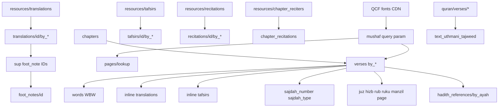

# Quran.Foundation API Analysis

**Probed:** 2026-08-01  
**Environment:** production (`https://oauth2.quran.foundation` + `https://apis.quran.foundation`)  
**Method:** Authenticated live HTTP probes with this project’s OAuth client (`content` scope). No Nest application code was changed for this report.  
**Rule:** Findings below are verified against live responses unless marked **Docs-only** or **Unavailable**.

Official sources used:

- https://api-docs.quran.foundation/docs/category/content-apis-4.0.0/
- https://api-docs.quran.foundation/docs/quickstart/
- https://api-docs.quran.foundation/docs/tutorials/fonts/font-rendering/
- https://api-docs.quran.foundation/docs/search_apis_versioned/1.0.0/quran-foundation-search-api/
- https://api-docs.quran.foundation/docs/category/user-related-apis/

Related local docs: [`quran-foundation.md`](./quran-foundation.md), [`qf-integration-contract.md`](./qf-integration-contract.md), [`qf-resource-ids.md`](./qf-resource-ids.md).

---

## 1. Executive summary

Quran.Foundation’s production Content API **v4** is the correct API surface for Quron Yo'li. Endpoint shapes largely match the older public `api.quran.com/api/v4` contract, but authenticated QF returns a **richer catalog** (145 translations vs 126 public; 23 tafsirs vs 20 public).

**Verified available and working with `content` scope:**

- Chapters, verses (by chapter/key/juz/page/hizb/rub/ruku/manzil), juz, pages, hizb, rub el hizb, ruku, manzil
- Resource catalogs: translations, tafsirs, recitations, chapter_reciters, languages, chapter_infos, recitation_styles, verse_media
- Translation/tafsir content bodies, chapter + ayah audio, timestamps
- Quran script endpoints including **Uthmani Tajweed**
- Footnotes via `/foot_notes/{id}` (real footnote IDs, not `1`)
- Hadith references via `/hadith_references/by_ayah/{verseKey}`
- Answers via `/answers/by_ayah/{verseKey}`
- Resource sync bootstrap

**Verified unavailable or blocked:**

| Item | Live result |
| --- | --- |
| `search` OAuth scope | Token endpoint `400 invalid_scope` for this client |
| Search API with content token | `403 insufficient_scope` |
| `/resources/mushafs` | `404` — mushafs are **IDs + query params**, not a resource catalog |
| `/resources/tajweed`, `/resources/tajweed_rules` | `404` — tajweed is script/HTML classes + mushaf `19`, not a palette catalog |
| `/sajdas`, `/resources/sajdas` | `404` — sajda appears as verse fields (`sajdah_number`, `sajdah_type`) |
| `/verses/by_range/...` | `404` |
| Translation ID `131` (Clear Quran in older docs/examples) | **Absent** from live QF catalog |
| Uzbek tafsirs | **None** in live catalog (`language_name: uzbek` count = 0) |
| Dedicated tajweed color-map endpoint | **Unavailable** |

**Quron Yo'li gap root causes (not “API missing” in most cases):**

1. **Tafsir** — upstream + Nest proxy already exist; product/UI must request them. Local sync has **all 23** tafsirs. No Uzbek tafsir exists upstream.
2. **Tajweed colors** — available via `/quran/verses/uthmani_tajweed` or verse `fields=text_uthmani_tajweed`, and/or mushaf `19` + `code_v2` fonts. App does not call script endpoints or pass those fields by default.
3. **Mushafs** — no catalog endpoint; use `mushaf=` on verses/pages. App accepts the param but does not expose a mushaf list or defaults.
4. **Some Qaris** — two ID spaces: **12** ayah recitations (synced) vs **20** chapter reciters (proxied, not synced). “Missing” reciters are usually chapter-only IDs.
5. **Some translations** — live QF has **145** (local DB also **145**). Gaps are filtering/UI, not incomplete sync. `language=` on `/resources/translations` did **not** filter the list in live tests.

**Recommendation:** Keep Content API **v4** on `apis.quran.foundation`. Request `search` scope entitlement from Quran.Foundation. Extend product/proxy for tajweed fields, mushaf IDs, chapter-reciter sync, hizb/rub routes, footnotes, and languages — rather than inventing local Quran text storage.

---

## 2. Authentication and environments

### 2.1 OAuth2 client credentials (verified)

| Item | Value |
| --- | --- |
| Token URL | `POST https://oauth2.quran.foundation/oauth2/token` |
| Auth | HTTP Basic `client_id:client_secret` |
| Body | `grant_type=client_credentials&scope={scope}` |
| Content scope | `content` → **200**, `expires_in ≈ 3599`, `token_type: bearer` |
| Search scope | `search` → **400** `invalid_scope` for this client |
| API headers | `x-auth-token: {access_token}`, `x-client-id: {client_id}` |
| Refresh token | None (re-request credentials) |

Sample token response shape (secrets omitted):

```json
{
  "access_token": "<redacted>",
  "token_type": "bearer",
  "expires_in": 3599,
  "scope": "content"
}
```

### 2.2 Environments

| `QF_ENV` | Auth base | API base |
| --- | --- | --- |
| `production` | `https://oauth2.quran.foundation` | `https://apis.quran.foundation` |
| `prelive` | `https://prelive-oauth2.quran.foundation` | `https://apis-prelive.quran.foundation` |

Content path prefix used by this app: `/content/api/v4`  
Search path prefix: `/search/v1`

### 2.3 Operational notes from live calls

- Cloudflare can block non-browser User-Agents on the token host (Python `urllib` got Error 1010). `curl` with a normal browser UA succeeded. Nest/Axios from this backend previously succeeded for content.
- Response headers observed on `GET /chapters` included Cloudflare cache (`cf-cache-status: HIT`, `cache-control: max-age=604800, public`) and Nest-unrelated `x-request-id` / `x-runtime`. **No `X-RateLimit-*` headers** were present on that response. Docs still document HTTP **429** `rate_limit_exceeded` as a possible status.

### 2.4 User-related APIs (inspect only)

Docs category: bookmarks, collections, comments, goals, notes, posts, preferences, reading sessions, activity days, rooms, streaks, tags, users.

These require **user OAuth**, not `client_credentials`/`content`. Quron Yo'li correctly keeps bookmarks/reading/goals local. **Do not implement QF user APIs** for current product scope.

---

## 3. Available endpoints (verified matrix)

Base: `https://apis.quran.foundation/content/api/v4`  
Auth: `content` token + `x-client-id` unless noted.

Legend: **QY** = currently used by Quron Yo'li Nest proxy.

### 3.1 Chapters

| Method | Path | Status | QY | Notes |
| --- | --- | --- | --- | --- |
| GET | `/chapters` | 200 | Yes | Optional `language` |
| GET | `/chapters/{id}` | 200 | Yes | Revelation fields present |
| GET | `/chapters/{id}/info` | 200 | Yes | |

### 3.2 Verses

| Method | Path | Status | QY | Notes |
| --- | --- | --- | --- | --- |
| GET | `/verses/by_chapter/{n}` | 200 | Yes | Pagination |
| GET | `/verses/by_key/{chapter:verse}` | 200 | Yes | |
| GET | `/verses/by_juz/{n}` | 200 | Yes | |
| GET | `/verses/by_page/{n}` | 200 | Yes | |
| GET | `/verses/by_hizb/{n}` | 200 | **No** | Live 200 |
| GET | `/verses/by_rub/{n}` | 200 | **No** | Live 200 |
| GET | `/verses/by_rub_el_hizb/{n}` | 200 | **No** | Live 200 |
| GET | `/verses/by_ruku/{n}` | 200 | **No** | Live 200 |
| GET | `/verses/by_manzil/{n}` | 200 | **No** | Live 200 |
| GET | `/verses/by_range/...` | 404 | No | **Unavailable** |

Common optional query params (verified useful):  
`language`, `page`, `per_page`, `translations`, `tafsirs`, `words`, `audio`, `fields`, `word_fields`, `translation_fields`, `tafsir_fields`, `mushaf`.

### 3.3 Quran scripts

| Method | Path | Status | QY |
| --- | --- | --- | --- |
| GET | `/quran/verses/uthmani` | 200 | No |
| GET | `/quran/verses/uthmani_tajweed` | 200 | No |
| GET | `/quran/verses/uthmani_simple` | 200 | No |
| GET | `/quran/verses/imlaei` | 200 | No |
| GET | `/quran/verses/indopak` | 200 | No |
| GET | `/quran/verses/code_v1` | 200 | No |
| GET | `/quran/verses/code_v2` | 200 | No |
| GET | `/quran/verses/qpc_hafs` | 200 | No |

Filters verified: `verse_key`, `chapter_number` (and docs also list juz/hizb/rub/manzil/ruku/page filters).

### 3.4 Juz / pages / divisions

| Method | Path | Status | QY | Live count |
| --- | --- | --- | --- | --- |
| GET | `/juzs` | 200 | Yes | 60 |
| GET | `/juzs/{id}` | 200 | Yes | |
| GET | `/pages` | 200 | Yes | 604 |
| GET | `/pages/{n}` | 200 | Yes | |
| GET | `/pages/lookup` | 200 | Yes | Needs `mushaf` (+ chapter/juz/page filters) |
| GET | `/hizbs` | 200 | No | 60 |
| GET | `/hizbs/{id}` | 200 | No | |
| GET | `/rub_el_hizbs` | 200 | No | 240 |
| GET | `/rub_el_hizbs/{id}` | 200 | No | |
| GET | `/rukus` | 200 | No | 558 |
| GET | `/rukus/{id}` | 200 | No | |
| GET | `/manzils` | 200 | No | 7 |
| GET | `/manzils/{id}` | 200 | No | |

### 3.5 Resources

| Method | Path | Status | QY | Live count / notes |
| --- | --- | --- | --- | --- |
| GET | `/resources/translations` | 200 | Yes | **145** |
| GET | `/resources/translations/{id}/info` | 200 | Yes | Often empty `info` string |
| GET | `/resources/tafsirs` | 200 | Yes | **23** |
| GET | `/resources/tafsirs/{id}/info` | 200 | Yes | |
| GET | `/resources/recitations` | 200 | Yes | **12** ayah audio resources |
| GET | `/resources/recitations/{id}/info` | 200 | No (info not proxied) | |
| GET | `/resources/chapter_reciters` | 200 | Yes (proxy) | **20** under key `reciters` |
| GET | `/resources/languages` | 200 | No | **79** |
| GET | `/resources/chapter_infos` | 200 | No | **8** |
| GET | `/resources/recitation_styles` | 200 | No | Object map (mujawwad/murattal/muallim) |
| GET | `/resources/verse_media` | 200 | No | **1** item (Bayyinah video) |
| GET | `/resources/sync` | 200 | No | Bootstrap/incremental sync |
| GET | `/resources/mushafs` | 404 | — | **Unavailable** |
| GET | `/resources/tajweed` | 404 | — | **Unavailable** |
| GET | `/resources/tajweed_rules` | 404 | — | **Unavailable** |
| GET | `/resources/sajdas` | 404 | — | **Unavailable** |

### 3.6 Translation / tafsir bodies

| Method | Path | Status | QY |
| --- | --- | --- | --- |
| GET | `/translations/{id}/by_chapter/{c}` | 200 | Yes |
| GET | `/translations/{id}/by_ayah/{key}` | 200 | Yes |
| GET | `/translations/{id}/by_juz/{j}` | (wired in app) | Yes |
| GET | `/translations/{id}/by_page/{p}` | (wired in app) | Yes |
| GET | `/tafsirs/{id}/by_chapter/{c}` | 200 | Yes |
| GET | `/tafsirs/{id}/by_ayah/{key}` | 200 | Yes |
| GET | `/tafsirs/{id}/by_juz/{j}` | (wired in app) | Yes |
| GET | `/tafsirs/{id}/by_page/{p}` | (wired in app) | Yes |

### 3.7 Audio

| Method | Path | Status | QY | Notes |
| --- | --- | --- | --- | --- |
| GET | `/chapter_recitations/{reciterId}` | 200 | Yes | |
| GET | `/chapter_recitations/{reciterId}/{chapter}` | 200 | Yes | Absolute `audio_url` |
| GET | `/recitations/{id}/by_chapter/{c}` | 200 | Yes | |
| GET | `/recitations/{id}/by_ayah/{key}` | 200 | Yes | Relative `url` path |
| GET | `/audio/reciters/{id}/timestamp` | 200 | Yes | |

### 3.8 Footnotes / hadith / answers / sajda

| Method | Path | Status | QY | Notes |
| --- | --- | --- | --- | --- |
| GET | `/foot_notes/{id}` | 200 for real IDs | No | ID from `<sup foot_note=...>` in translation HTML |
| GET | `/foot_notes/1` | 404 | — | Doc example ID `1` is not a live footnote |
| GET | `/hadith_references/by_ayah/{key}` | 200 | No | |
| GET | `/hadiths/by_ayah/{key}` | 404 | — | Guessed path; expanded hadith body path not confirmed live |
| GET | `/answers/by_ayah/{key}` | 200 | No | |
| GET | `/sajdas` | 404 | — | Use verse sajdah fields |

### 3.9 Search

| Method | URL | Auth | Status |
| --- | --- | --- | --- |
| POST | `/oauth2/token` scope=`search` | Basic | **400 invalid_scope** |
| GET | `https://apis.quran.foundation/search/v1/search?query=Yasin&...` | content token | **403 insufficient_scope** |

Search is documented but **not usable** with the current client entitlement.

---

## 4. Missing / unavailable endpoints

### Confirmed 404 / not a catalog

- `/resources/mushafs`
- `/resources/tajweed`, `/resources/tajweed_rules`
- `/resources/sajdas`, `/sajdas`
- `/verses/by_range/...`
- Footnote ID `1` (docs sample only)
- Several guessed hadith body paths

### Exists in docs but needs correct path / real IDs

- Footnotes: `/foot_notes/{realId}` works
- Hadith references: `/hadith_references/by_ayah/{verseKey}` works
- Expanded hadith payloads: documented (`hadithsByAyah` in SDK) — exact HTTP path **not confirmed** in this probe set beyond references

### Entitlement-blocked

- Entire Search API for this client (`search` scope)

---

## 5. Resource relationships



Important ID-space rule:

- **Ayah recitation IDs** (`/resources/recitations`, 1–12) feed `/recitations/{id}/...`
- **Chapter reciter IDs** (`/resources/chapter_reciters`, includes 13, 19, 158–175, …) feed `/chapter_recitations/{id}/...`
- Do not mix them in settings without labeling the resource type

---

## 6. Feature existence checklist

| Feature | Exists? | How to get it | Notes |
| --- | --- | --- | --- |
| Tajweed-enabled verses | **Yes** | `/quran/verses/uthmani_tajweed` or verse `fields=text_uthmani_tajweed` | HTML `<tajweed class=...>` tags |
| Tajweed color palette catalog | **No** | N/A | Colors are CSS/font responsibility; classes listed below |
| Glyph Tajweed mushaf | **Yes** | `mushaf=19` + `words=true&word_fields=code_v2` | Docs: QCF V4 Tajweed |
| Mushaf catalog endpoint | **No** | Use known mushaf IDs | See §7 |
| All translations | **Yes** | `/resources/translations` | Live **145**; DB synced **145** |
| All tafsirs | **Yes** | `/resources/tafsirs` | Live **23**; DB synced **23**; **0 Uzbek** |
| All ayah Qaris | **Yes** | `/resources/recitations` | **12**; DB synced **12** |
| All chapter Qaris | **Yes** | `/resources/chapter_reciters` | **20**; **not** in local `quran_reciters` |
| Word translations | **Yes** | `words=true` | `words[].translation.text` |
| Verse images | **Partial** | `fields` including `image_url` / `image_width` | Protocol-relative CDN URL returned |
| Verse media catalog “images” | **Not as documented sample** | `/resources/verse_media` | Live list has Bayyinah **video** only (id 64) |
| Audio files | **Yes** | chapter + ayah endpoints | Chapter URLs absolute; ayah often relative |
| Verse keys | **Yes** | `verse_key` on verses | e.g. `"1:1"` |
| Revelation info | **Yes** | chapter `revelation_place`, `revelation_order` | e.g. Al-Fatihah makkah / 5 |
| Sajda list endpoint | **No** | verse `sajdah_number` / `sajdah_type` | Null on 1:1; present as fields |

### Tajweed classes observed on `2:255`

`end`, `ham_wasl`, `idgham_ghunnah`, `idgham_wo_ghunnah`, `ikhafa`, `laam_shamsiyah`, `madda_normal`, `madda_obligatory`, `madda_permissible`

There is **no** API that returns hex colors for these classes. Frontend CSS (or QCF V4 font palettes) must define colors.

### Mushaf IDs (docs + live param accepts 1–7 and 19)

From official font tutorial (verified `mushaf=` requests all returned HTTP 200):

| Mushaf ID | Font / use |
| --- | ---: |
| 1 | QCF V2 (`code_v2`) — recommended Madani |
| 2 | QCF V1 (`code_v1`) |
| 3, 6, 7 | IndoPak |
| 4 | Uthmani Unicode |
| 5 | QPC Hafs |
| 19 | QCF V4 Tajweed (`code_v2`) |

---

## 7. JSON schemas / sample payloads (sanitized)

### Chapter

```json
{
  "chapter": {
    "id": 1,
    "revelation_place": "makkah",
    "revelation_order": 5,
    "bismillah_pre": false,
    "name_simple": "Al-Fatihah",
    "name_complex": "Al-Fātiĥah",
    "name_arabic": "الفاتحة",
    "verses_count": 7,
    "pages": [1, 1],
    "translated_name": { "language_name": "english", "name": "The Opener" }
  }
}
```

### Verse by key (selected fields + words)

Request:

```http
GET /content/api/v4/verses/by_key/1:1?language=en&words=true&translations=20&fields=text_uthmani,text_uthmani_tajweed,image_url,image_width,verse_key,juz_number,hizb_number,rub_el_hizb_number,page_number
x-auth-token: <token>
x-client-id: <client_id>
```

Observed fields include: `verse_key`, division numbers, `image_url` (`//c22506.r6.cf1.rackcdn.com/1_1.png`), `image_width` (675), `words[]` with `translation` / `transliteration`, inline `translations[]`, and tajweed text when requested.

### Uthmani Tajweed script

```json
{
  "verses": [
    {
      "id": 1,
      "verse_key": "1:1",
      "text_uthmani_tajweed": "بِسْمِ <tajweed class=ham_wasl>ٱ</tajweed>للَّهِ ..."
    }
  ],
  "meta": { "filters": { "verse_key": "1:1" } }
}
```

### Ayah audio

```json
{
  "audio_files": [{ "verse_key": "1:1", "url": "Alafasy/mp3/001001.mp3" }],
  "pagination": {
    "per_page": 10,
    "current_page": 1,
    "next_page": null,
    "total_pages": 1,
    "total_records": 1
  }
}
```

Relative ayah URLs need a CDN base (commonly Quran.com audio CDN). Confirm absolute base in product code before shipping players.

### Chapter audio

```json
{
  "audio_file": {
    "id": 911,
    "chapter_id": 1,
    "file_size": 839808,
    "format": "mp3",
    "audio_url": "https://download.quranicaudio.com/qdc/mishari_al_afasy/murattal/1.mp3"
  }
}
```

### Footnote

Translation HTML marker: `<sup foot_note=227235>1</sup>`

```http
GET /content/api/v4/foot_notes/227235
```

```json
{
  "foot_note": {
    "id": 227235,
    "text": "Whose life is perfect, complete and eternal, without beginning or end, and through whom all created life originated and continues.",
    "language_name": "english"
  }
}
```

### Pagination shape (verses)

```json
{
  "pagination": {
    "per_page": 3,
    "current_page": 1,
    "next_page": 2,
    "total_pages": 3,
    "total_records": 7
  }
}
```

Quron Yo'li caps `per_page` at **100** in DTOs.

---

## 8. Docs vs live diffs

| Topic | Docs / examples | Live production |
| --- | --- | --- |
| Clear Quran id `131` | Appears in examples/tutorials | **Not in** `/resources/translations` |
| Footnote id `1` | Schema example | **404**; real IDs are large integers from HTML |
| Verse media “Verse images” sample | Docs sample catalog entry | Live catalog returned **Bayyinah video** only |
| `language` on translations list | Implies localization/filter | `?language=uz` and `?language=en` returned **same 145** items |
| Mushaf resources | Font tutorial lists IDs | No `/resources/mushafs` endpoint |
| Tajweed | Script + fonts | No tajweed resource catalog |
| Public `api.quran.com` | Legacy unauthenticated | Works without OAuth; smaller catalogs (126 tr / 20 tf) |
| Search | Documented Search v1 | Denied for this client |

---

## 9. Quron Yo'li current coverage vs gaps

### Already proxied under `/api/v1/quran/*` (JWT)

Surahs, ayahs (surah/key/juz/page + daily), juz, pages (+ lookup), translations, tafsirs, audio (both catalogs), search route (upstream blocked).

### Local catalog sync (`qf:sync-catalog`)

| Table | Upstream source | Live QF | Local DB (active) |
| --- | --- | --- | --- |
| `quran_translations` | `/resources/translations` | 145 | **145** |
| `quran_tafsirs` | `/resources/tafsirs` | 23 | **23** |
| `quran_reciters` | `/resources/recitations` only | 12 | **12** |

### Why features look “missing”

| Symptom | Classification | Explanation |
| --- | --- | --- |
| Tafsir missing in UI | Available; not product-wired enough | Nest already proxies catalogs + bodies. Call `tafsirs` query or `/tafsirs/{id}/by_*`. No Uzbek tafsir upstream. |
| Tajweed colors missing | Available via params/endpoints; not default | Need `fields=text_uthmani_tajweed` and/or `/quran/verses/uthmani_tajweed` and/or `mushaf=19` + fonts. No color palette API. |
| Mushafs missing | Available as IDs; no catalog | Hardcode/document mushaf ID map; pass `mushaf` on verses/pages/lookup. |
| Some Qaris missing | Wrong catalog / not synced | Chapter-only reciters (Ajmy, Ghamdi, Muaiqly, Yasser, etc.) are in `chapter_reciters`, not ayah `recitations`. |
| Some translations missing | Likely UI filter / wrong ID | Sync is complete (145=145). ID `131` truly absent. Uzbek IDs: **55, 101, 127, 868**. |
| Search failing | OAuth entitlement | Request `search` scope from QF. |
| Hizb / Rub / Ruku / Manzil UX | Upstream available; Nest not wired | Add proxy routes if product needs them. |
| Footnotes | Upstream available; Nest not wired | Parse `foot_note` attrs; fetch `/foot_notes/{id}`. |

---

## 10. Endpoints used by Quron Yo'li (detail)

For each Nest-backed upstream call:

### Auth

- **Method/URL:** `POST {authBase}/oauth2/token`
- **Required:** Basic auth, `grant_type`, `scope`
- **Auth:** client credentials
- **Sample:** see §2
- **Pagination / rate limit:** N/A / docs 429 on APIs

### Content pattern

- **Method:** `GET`
- **URL:** `{apiBase}/content/api/v4{path}`
- **Required headers:** `x-auth-token`, `x-client-id`
- **Optional:** path-specific query params from `VersesQueryDto` / language / pagination
- **Auth:** `content` scope token
- **Missing fields:** runtime returns opaque `unknown` passthrough; typed contracts exist but are unwired
- **Pagination:** verse/translation/tafsir/audio list endpoints return `pagination` object
- **Rate limits:** app-side Redis guard (`QF_RATE_LIMIT_MAX`, default 60/min/user); upstream 429 documented; no rate headers observed on sample chapter response

Paths (see §3 for status):  
`/chapters*`, `/verses/by_{chapter,key,juz,page}`, `/juzs*`, `/pages*`, `/resources/{translations,tafsirs,recitations,chapter_reciters}*`, `/translations/{id}/by_*`, `/tafsirs/{id}/by_*`, `/chapter_recitations*`, `/recitations/{id}/by_*`, `/audio/reciters/{id}/timestamp`, `/search` (Search host).

---

## 11. Recommended endpoints for product features

| Product need | Recommended upstream |
| --- | --- |
| Surah list / meta | `/chapters`, `/chapters/{id}`, `/chapters/{id}/info` |
| Reader verses | `/verses/by_chapter/{n}` or `/by_page/{n}` with `words`, `translations`, `fields` |
| Tajweed learning (HTML) | `/quran/verses/uthmani_tajweed` or `fields=text_uthmani_tajweed` |
| Tajweed glyph mushaf | `mushaf=19&words=true&word_fields=code_v2,page_number` + QCF V4 fonts |
| Standard mushaf look | `mushaf=1&words=true&word_fields=code_v2,page_number` |
| Translation picker | `/resources/translations` (+ client-side language filter) |
| Tafsir picker | `/resources/tafsirs` |
| Tafsir panel | `/tafsirs/{id}/by_ayah/{key}` or verse `tafsirs=` |
| Ayah audio | `/resources/recitations` + `/recitations/{id}/by_ayah/{key}` |
| Full-surah audio | `/resources/chapter_reciters` + `/chapter_recitations/{id}/{chapter}` |
| Footnotes | parse HTML → `/foot_notes/{id}` |
| Languages metadata | `/resources/languages` |
| Offline/catalog freshness | `/resources/sync` + snapshots |
| Search | `/search/v1/search` **after** scope grant |
| Hizb navigation | `/hizbs`, `/verses/by_hizb/{n}` |

---

## 12. Recommended cache strategy

Align with current Nest Redis TTLs, with these adjustments grounded in live behavior:

| Data | Suggested TTL | Reason |
| --- | --- | --- |
| Chapters / juz / hizb / pages meta | 24h–7d | Extremely stable; CF also caches some GETs for 7d |
| Resource catalogs | 24h + nightly sync | New translation IDs appear on QF over time |
| Verses / translations / tafsirs bodies | 1h–6h | Stable text; invalidate on resource sync mutations |
| Tajweed script | 24h | Immutable per verse |
| Audio metadata URLs | 15–60m | CDN paths may change; chapter URLs absolute today |
| Search | 2–5m | Query-specific; currently blocked anyway |
| OAuth tokens | `expires_in - 30s` | Already implemented |

Prefer single-flight upstream fetches (already implemented). Consider adopting `/resources/sync` instead of full catalog re-download for incremental updates.

---

## 13. Potential issues and best practices

1. **Never expose `QF_CLIENT_SECRET` to the Mini App.** Keep token minting server-side (already done).
2. **Separate content vs search tokens** when search entitlement arrives.
3. **Treat ayah vs chapter reciter IDs as different namespaces.**
4. **Resolve relative ayah audio URLs** before returning to clients, or document the CDN base explicitly.
5. **Render translation HTML carefully** (footnotes are `<sup foot_note>`). Prefer sanitization + click handlers.
6. **Do not expect `/resources/translations?language=uz` to filter** until QF behavior changes; filter client-side by `language_name` / ISO from `/resources/languages`.
7. **Cloudflare / UA sensitivity** on OAuth host — use standard HTTP clients; avoid exotic crawler signatures in scripts.
8. **Image URLs are protocol-relative** (`//cdn...`); normalize to `https:`.
9. **User APIs are a different product surface**; avoid conflating them with Content v4.
10. **Typed contracts** under `src/modules/quran/contracts/` should be wired eventually to catch field drift.

---

## 14. Version recommendation

| Version / host | Auth | Verdict |
| --- | --- | --- |
| **Content API v4 on `apis.quran.foundation`** | OAuth2 `content` | **Recommended production standard** |
| Search API v1 on same host | OAuth2 `search` | Required for search; pending entitlement |
| Legacy `https://api.quran.com/api/v4` | None | Useful for public experiments; smaller catalogs; **not** the production integration path |
| Content v3 | — | Not used by official QF quickstart/migration; **do not target for new work** |

Migration docs explicitly say paths/query params remain largely the same when moving from `api.quran.com` to QF; the change is base URL + OAuth headers.

---

## 15. Concrete recommendations for Quron Yo'li

### Immediate (no QF entitlement change)

1. Document mushaf ID map in API/settings and pass `mushaf` from the Mini App.
2. Add reader support for `fields=text_uthmani_tajweed` **or** proxy `/quran/verses/uthmani_tajweed`.
3. Keep using tafsir proxy routes; pick defaults from live IDs (`169` EN Ibn Kathir, `16`/`926` AR options — re-validate before hardcoding).
4. Split settings: `ayahRecitationId` vs `chapterReciterId`; optionally sync chapter reciters into Postgres.
5. Filter translations locally for `uz` / `en` / `ru`; expose ID **868** as newer Uzbek option.
6. Stop referencing translation **131** until it appears in live QF catalog.
7. Add footnote proxy: `GET /api/v1/quran/footnotes/:id` → upstream `/foot_notes/:id`.
8. Normalize audio + image URLs in the proxy response layer.

### Next

9. Request Quran.Foundation **`search` scope** for the production client.
10. Proxy hizb/rub/ruku/manzil if the product navigation needs them.
11. Consider `/resources/sync` for catalog maintenance.
12. Wire typed QF contracts to replace `Promise<unknown>` passthrough.

### Explicit non-goals (reaffirmed)

- Do not store full Quran text / audio blobs in Postgres.
- Do not implement QF user APIs for bookmarks/notes (own them locally).
- Do not invent a mushaf/tajweed catalog endpoint that does not exist upstream.

---

## Appendix A — Live catalog counts (2026-08-01)

| Catalog | QF live | Local DB active | Public api.quran.com |
| --- | ---: | ---: | ---: |
| Translations | 145 | 145 | 126 |
| Tafsirs | 23 | 23 | 20 |
| Ayah recitations | 12 | 12 | 12 |
| Chapter reciters | 20 | 0 (not synced) | — |
| Languages | 79 | — | — |

Uzbek translations (live): **55, 101, 127, 868**.  
Uzbek tafsirs (live): **none**.

## Appendix B — Probe failures (exact)

```
404 verses_by_range
404 resources_mushafs
404 resources_tajweed
404 resources_tajweed_rules
404 resources_sajdas
404 sajdas
404 foot_notes/1          (real ID 227235 → 200)
403 search with content token
400 search scope token request
```

## Appendix C — Sample request template

```bash
# 1) Token
curl -u "$QF_CLIENT_ID:$QF_CLIENT_SECRET" \
  -X POST https://oauth2.quran.foundation/oauth2/token \
  -H 'Content-Type: application/x-www-form-urlencoded' \
  -d 'grant_type=client_credentials&scope=content'

# 2) Content call
curl 'https://apis.quran.foundation/content/api/v4/chapters' \
  -H "x-auth-token: $ACCESS_TOKEN" \
  -H "x-client-id: $QF_CLIENT_ID"
```

Tokens, client secrets, and raw access tokens are intentionally omitted from this document.
