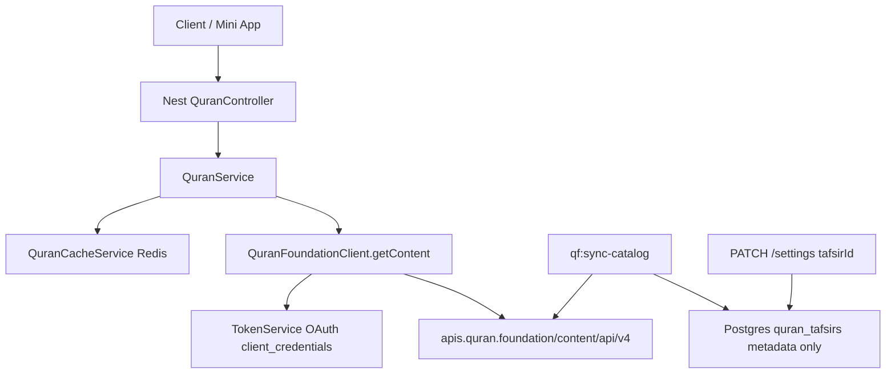

# Tafsir API Analysis

Investigation-only report. **No application source code was modified.** Findings are based on reading Nest proxies/clients, prior QF contract docs, and live HTTP checks against the public Quran.com Content API v4 (same endpoint family as Quran.Foundation). Authenticated calls to `apis.quran.foundation` from this environment failed at OAuth (Cloudflare Error 1010); unauthenticated QF calls return 400 missing headers.

---

## Current Backend Flow



### Where Tafsir is requested

| Layer | Behavior |
| --- | --- |
| Dedicated Nest routes | Always proxy upstream tafsir catalog/body paths (see Endpoint Used). |
| Verse / page verse routes | Forward `tafsirs` and `tafsir_fields` **only if the client sends them**. Page defaults add Arabic text fields + `words=true` + `mushaf=1` — **no default tafsir**. |
| User settings | `defaultTafsirId` is stored/validated against local `quran_tafsirs`; it is **not** auto-injected into Quran verse/tafsir proxies. |
| Catalog sync (`qf:sync-catalog`) | Fetches `/resources/tafsirs` and upserts **metadata only** into Postgres. Tafsir HTML/text is never persisted. |

### Service that calls Quran.Foundation

[`QuranFoundationClient`](../src/modules/quran/client/quran-foundation.client.ts) via [`QuranService`](../src/modules/quran/quran.service.ts) → `getContent(path, query)`.

URL construction:

```text
{QF_API_BASE_URL}{QF_CONTENT_PATH_PREFIX}{path}
```

Production defaults:

- `QF_API_BASE_URL` = `https://apis.quran.foundation`
- `QF_CONTENT_PATH_PREFIX` = `/content/api/v4`

### Authentication headers

Every content request includes:

| Header | Value |
| --- | --- |
| `x-auth-token` | OAuth2 access token (`client_credentials`, scope `content`) |
| `x-client-id` | `QF_CLIENT_ID` |
| `Accept` | `application/json` |

Token mint: `POST {QF_AUTH_BASE_URL}/oauth2/token` with HTTP Basic `clientId:clientSecret`.

Unauthenticated probe to QF:

```http
GET https://apis.quran.foundation/content/api/v4/tafsirs/169/by_ayah/1:1
```

Response: **400**

```json
{
  "message": "The request is missing required headers or is invalid",
  "type": "invalid_request",
  "success": false
}
```

---

## Endpoint Used

### App (Nest) → Upstream (QF Content v4)

| App path | Upstream path |
| --- | --- |
| `GET /api/v1/quran/tafsirs` | `GET /resources/tafsirs` |
| `GET /api/v1/quran/tafsirs/:tafsirId/info` | `GET /resources/tafsirs/:id/info` |
| `GET /api/v1/quran/tafsirs/:resourceId/by-surah/:chapter` | `GET /tafsirs/:id/by_chapter/:c` |
| `GET /api/v1/quran/tafsirs/:resourceId/by-ayah/:ayahKey` | `GET /tafsirs/:id/by_ayah/:key` |
| `GET /api/v1/quran/tafsirs/:resourceId/by-juz/:juz` | `GET /tafsirs/:id/by_juz/:j` |
| `GET /api/v1/quran/tafsirs/:resourceId/by-page/:page` | `GET /tafsirs/:id/by_page/:p` |
| Verse routes with `?tafsirs=` | `GET /verses/by_*?tafsirs=...` |
| `GET /api/v1/quran/pages/:n/verses?tafsirs=` | `GET /verses/by_page/:n?tafsirs=...` (+ page defaults) |

Controller: [`quran.controller.ts`](../src/modules/quran/quran.controller.ts).  
Service methods: `getTafsirs`, `getTafsirInfo`, `getTafsirBySurah`, `getTafsirByAyah`, `getTafsirByJuz`, `getTafsirByPage`, plus `verseQuery` / `verseQueryWithPageDefaults`.

### Query parameters forwarded

| Context | Params |
| --- | --- |
| Catalog list | `language` (optional) |
| Tafsir info | none |
| by-surah / by-juz / by-page | `language`, `page`, `per_page` (optional) |
| by-ayah | none (resource id + ayah key in path) |
| Verses (inline) | `tafsirs` (comma-separated resource IDs), `tafsir_fields`, plus other verse filters |

`translation_id` is **not** used for tafsir. Tafsir resources are identified by numeric **resource id** in the path (`/tafsirs/{id}/...`) or in the `tafsirs` query string.

---

## Request Example

### Recommended: tafsir body by ayah (via Nest)

```http
GET /api/v1/quran/tafsirs/169/by-ayah/1:1
Authorization: Bearer <app JWT>
```

Nest then calls (conceptually):

```http
GET https://apis.quran.foundation/content/api/v4/tafsirs/169/by_ayah/1%3A1
x-auth-token: <oauth access_token>
x-client-id: <QF_CLIENT_ID>
Accept: application/json
```

### Equivalent public Quran.com verification request (used in this investigation)

```http
GET https://api.quran.com/api/v4/tafsirs/169/by_ayah/1:1
Accept: application/json
```

### Catalog

```http
GET https://api.quran.com/api/v4/resources/tafsirs
Accept: application/json
```

### Inline on verses (opt-in; may differ between public vs authenticated QF)

```http
GET /api/v1/quran/ayahs/by-key/1:1?tafsirs=169
```

Upstream:

```http
GET .../content/api/v4/verses/by_key/1:1?tafsirs=169
```

---

## Response Status

| Probe | Status | Notes |
| --- | --- | --- |
| Public `GET /tafsirs/169/by_ayah/1:1` | **200** | Full HTML tafsir returned (~53 138 chars of `text`) |
| Public `GET /tafsirs/169/by_chapter/1?per_page=2` | **200** | Array `tafsirs[]` + `pagination` |
| Public `GET /resources/tafsirs` | **200** | Catalog (~20 on public; project docs report **23** on authenticated QF) |
| Public `GET /resources/tafsirs/169/info` | **404** | `"Tafsir not found"` on public host; Nest still wires this path for QF — re-validate against authenticated QF |
| Public `GET /verses/by_key/1:1?tafsirs=169` | **200** | Verse returned **without** a `tafsirs` array on public API |
| QF without auth headers | **400** | `invalid_request` |
| QF OAuth from this environment | **403** | Cloudflare Error 1010 (browser/signature block) — live authenticated QF body not re-fetched here |
| Prior project contract sample (authenticated QF) | **200** | Documents inline `verse.tafsirs[]` when `tafsirs=169` is passed — see [`qf-integration-contract.md`](./qf-integration-contract.md) |

**Verdict:** Tafsir **is** returned from the Quran.com Content API when using dedicated `/tafsirs/{id}/by_*` endpoints with a valid resource id (e.g. **169**). The Nest backend proxies those paths correctly. Absence of tafsir in Mini App responses usually means the client never requested it.

---

## Raw JSON Response

### A) By ayah — public 200 (truncated `text`)

Full live response shape from:

`GET https://api.quran.com/api/v4/tafsirs/169/by_ayah/1:1`

```json
{
  "tafsir": {
    "verses": {
      "1:1": {
        "id": 1
      }
    },
    "resource_id": 169,
    "resource_name": "Ibn Kathir (Abridged)",
    "language_id": 38,
    "slug": "en-tafisr-ibn-kathir",
    "translated_name": {
      "name": "Ibn Kathir (Abridged)",
      "language_name": "english"
    },
    "text": "<h1><span style=\"color: rgb(59, 62, 102);\">Introduction to Fatihah</span></h1><h2>Which was revealed in Makkah</h2><h2>The Meaning of Al-Fatihah and its Various Names</h2><p>This Surah is called</p><p>- Al-Fatihah, that is, the Opener of the Book, the Surah with which prayers are begun.</p><p>- It is also called, Umm Al-Kitab (the Mother of the Book), according to the majority of the scholars.</p><p>In an authentic Hadith recorded by At-Tirmidhi, who graded it Sahih, Abu Hurayrah said that the Messenger of Allah <strong style=\"color: rgb(95, 99, 104);\">ﷺ </strong>said,</p><p>الْحَمْدُ للهِ رَبَ الْعَالَمِينَ أُمُّ الْقُرْآنِ وَأُمُّ الْكِتَابِ وَالسَّبْعُ الْمَثَانِي وَالْقُرْآنُ الْعَظِيمُ</p><p>Al-Hamdu lillahi Rabbil-`Alamin is the Mother of the Qur'an, the Mother of the Book, and the s…[truncated; full text length ≈ 53138 characters]"
  }
}
```

Note: `by_ayah` uses a **singular** top-level key `tafsir` (object), not `tafsirs` (array).

### B) By chapter — public 200 (truncated)

`GET https://api.quran.com/api/v4/tafsirs/169/by_chapter/1?per_page=2`

```json
{
  "tafsirs": [
    {
      "id": 82641,
      "resource_id": 169,
      "verse_key": "1:1",
      "language_id": 38,
      "slug": "en-tafisr-ibn-kathir",
      "text": "<h1>…Introduction to Fatihah…</h1>…[truncated HTML]"
    }
  ],
  "pagination": {
    "per_page": 2,
    "current_page": 1,
    "next_page": 2,
    "total_pages": 4,
    "total_records": 7
  }
}
```

### C) Catalog sample (abridged)

```json
{
  "tafsirs": [
    {
      "id": 169,
      "name": "Ibn Kathir (Abridged)",
      "author_name": "Hafiz Ibn Kathir",
      "slug": "en-tafisr-ibn-kathir",
      "language_name": "english",
      "translated_name": {
        "name": "Ibn Kathir (Abridged)",
        "language_name": "english"
      }
    }
  ]
}
```

### D) Authenticated QF inline verse sample (from project contract docs — not re-fetched here)

When `tafsirs=169` is passed on authenticated QF `/verses/by_chapter/...`, prior docs show:

```json
{
  "tafsirs": [
    {
      "id": 82641,
      "resource_id": 169,
      "language_name": "english",
      "name": "Tafsir Ibn Kathir",
      "text": "<h2 class=\"title\">…</h2>"
    }
  ]
}
```

(nested under each verse object).

---

## Parsed JSON Structure

### By-ayah body (`tafsir` object)

| Field | Type | Meaning |
| --- | --- | --- |
| `tafsir.resource_id` | number | Catalog / resource id (e.g. 169) |
| `tafsir.resource_name` | string | Display name |
| `tafsir.slug` | string | Stable slug |
| `tafsir.language_id` | number | Upstream language id |
| `tafsir.translated_name` | object | Localized name |
| `tafsir.verses` | object map | Keys like `"1:1"` → `{ id }` (related verse ids) |
| `tafsir.text` | string | **HTML** commentary body |

### By-chapter / by-juz / by-page (`tafsirs[]`)

| Field | Type | Meaning |
| --- | --- | --- |
| `tafsirs[].id` | number | Row id for this tafsir segment |
| `tafsirs[].resource_id` | number | Catalog resource id |
| `tafsirs[].verse_key` | string | e.g. `"1:1"` |
| `tafsirs[].text` | string | HTML body for that ayah |
| `pagination` | object | `per_page`, `current_page`, `next_page`, `total_pages`, `total_records` |

### Catalog (`tafsirs[]` resources)

| Field | Type | Meaning |
| --- | --- | --- |
| `id` | number | **Resource id** used in paths and `?tafsirs=` |
| `name` | string | Resource title |
| `author_name` | string | Author |
| `language_name` | string | e.g. `english`, `arabic` |
| `slug` | string \| null | Slug |
| `translated_name` | object | Optional localized label |

### Multiple tafsirs?

- **Dedicated body routes:** one resource id per URL (`/tafsirs/169/...`). To show two commentaries, call twice (or use inline verse query).
- **Inline verse query (QF):** `?tafsirs=169,16` can return multiple objects in `verse.tafsirs[]` (documented for authenticated QF).
- Public `by_key?tafsirs=169` in this investigation did **not** populate `tafsirs` — prefer dedicated `/tafsirs/{id}/by_*` for reliability.

### How resources are identified

Numeric **`id`** from `GET /resources/tafsirs` (synced to Postgres `quran_tafsirs.external_id`). Examples from [`qf-resource-ids.md`](./qf-resource-ids.md): EN **169** (Ibn Kathir Abridged), AR **16** (Muyassar), RU **170** (Al-Sa'di). **No Uzbek tafsir** in the upstream catalog.

---

## Required Parameters

| Call | Required | Optional |
| --- | --- | --- |
| Nest Quran routes | App JWT (+ rate limit) | — |
| QF content proxy | Valid OAuth token + `x-client-id` | — |
| Catalog | — | `language` |
| By-ayah | Path: `{resourceId}`, `{ayahKey}` (e.g. `1:1`) | — |
| By-chapter / juz / page | Path resource + chapter/juz/page | `language`, `page`, `per_page` |
| Inline on verses | Query `tafsirs=<id>[,<id>…]` | `tafsir_fields`, other verse params |

Env required for Nest → QF: `QF_CLIENT_ID`, `QF_CLIENT_SECRET` (plus Redis for token cache).

---

## Missing Parameters

Nothing is missing on the **dedicated** Nest → QF tafsir body/catalog wiring for a correct request.

What is **intentionally absent** unless the client supplies it:

| Item | Effect |
| --- | --- |
| `tafsirs` on `/pages/:n/verses` or `/ayahs/by-*` | No inline tafsir in verse payload |
| Auto-use of `settings.defaultTafsirId` | Preference stored only; not applied to Quran proxies |
| `translation_id` for tafsir | Not applicable — use tafsir **resource id** |
| Uzbek tafsir resource | Does not exist upstream |

Shape caveat (not a missing param): TypeScript contract sketches often show `TafsirContentResponse.tafsirs[]`, but public **`by_ayah` returns singular `tafsir`**. Frontends must handle both shapes.

---

## Mapping Recommendation

### Tafsir picker (settings / UI)

Call `GET /api/v1/quran/tafsirs` (or local catalog after `qf:sync-catalog`).

Map:

- `id` → selected resource id (store as settings `tafsirId` / external id string)
- `name`, `author_name`, `language_name`, `slug` → labels

Suggested defaults: EN **169**, AR **16**, RU **170**.

### Ayah tafsir panel (preferred)

Call:

```http
GET /api/v1/quran/tafsirs/{resourceId}/by-ayah/{ayahKey}
```

Map into UI:

| Upstream | Frontend |
| --- | --- |
| `tafsir.resource_id` / `tafsirs[].resource_id` | Selected commentary id |
| `tafsir.resource_name` / name fields | Title |
| `tafsir.slug` | Analytics / keys |
| `tafsir.text` / `tafsirs[].text` | Body — **HTML**; sanitize before render |
| `tafsirs[].verse_key` | Confirm ayah alignment |
| `tafsir.verses` | Optional related-verse map |

### Page / verse list with inline tafsir

Pass `?tafsirs={id}` on verse/page endpoints when using authenticated QF via Nest. Still treat dedicated by-ayah as the reliable panel API.

Do **not** expect Postgres to contain tafsir text — only relationships/catalog metadata.

---

## Root Cause (if failing)

Upstream tafsir content **works**. When the product shows no tafsir, typical causes are:

1. **Client never requests it** — hits `/pages/:page/verses` or ayah routes without `?tafsirs=` and never calls `/tafsirs/:id/by-*`.
2. **Settings default not applied** — `defaultTafsirId` is not injected by the backend into Quran proxies.
3. **QF auth failure** — missing/invalid `QF_CLIENT_ID` / `QF_CLIENT_SECRET`, or network/Cloudflare blocking OAuth (403 Error 1010 observed in this investigation environment).
4. **Wrong expectation for Uzbek** — zero Uzbek tafsirs in catalog.
5. **Response shape mismatch** — parsing `by_ayah` as `tafsirs[]` when the payload is `{ tafsir: { ... } }`.
6. **Relying on public inline `?tafsirs=`** — public `by_key` may omit `tafsirs` even with 200; use dedicated body endpoints.

Incorrect endpoint is **not** the primary issue for dedicated proxies: Nest paths match QF `/tafsirs/{id}/by_*` and `/resources/tafsirs`.

---

## Recommended Fix

Documentation / product wiring only (not implemented in this task):

1. **Frontend:** For the tafsir panel, call `GET /api/v1/quran/tafsirs/{defaultOrSelectedId}/by-ayah/{verseKey}`.
2. **Frontend:** When loading pages/verses and wanting inline commentary, pass `tafsirs=<resourceId>` explicitly (and handle missing inline gracefully).
3. **Optional later (backend):** Inject `settings.defaultTafsirId` into verse/page verse queries when the client omits `tafsirs` — currently out of scope.
4. **Frontend adapter:** Normalize singular `tafsir` (by-ayah) vs `tafsirs[]` (by-chapter / inline).
5. **Ops:** Ensure QF OAuth works in the deployment environment; re-validate `/resources/tafsirs/{id}/info` against authenticated QF (404 on public host).

---

## Conclusion

- The backend **does** implement a complete Tafsir proxy to Quran.Foundation Content API v4, with OAuth headers `x-auth-token` and `x-client-id`.
- Catalog metadata is synced to `quran_tafsirs`; **tafsir text is never stored** in Postgres.
- Live public Quran.com checks confirm **`GET /tafsirs/169/by_ayah/1:1` returns HTTP 200** with a large HTML `text` field — tafsir data **is** available from the content API.
- Tafsir is **opt-in** on verse/page Nest routes. If the Mini App does not pass `tafsirs` or call `/tafsirs/:id/by-*`, responses correctly contain no tafsir.
- Prefer dedicated by-ayah Nest routes for UI panels; identify resources by numeric catalog `id` (e.g. 169 / 16 / 170).

No source code was changed for this report.
